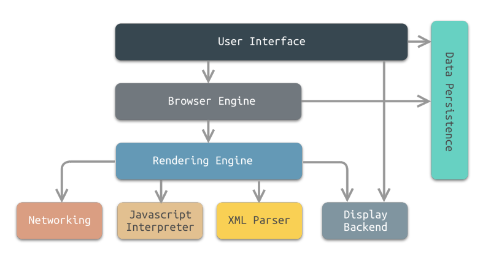

# 浏览器

## 从输入URL到页面加载的全过程

1. `DNS` 域名解析：浏览器根据 `URL` 中的域名（如www.baidu.com）查找对应的 `IP` 地址（如220.114.23.56），这个过程可能涉及到浏览器缓存、本机缓存、路由器缓存、`ISP DNS` 缓存和 `DNS` 递归查询等。

2. `TCP` 连接：浏览器根据 `IP` 地址和端口号（默认为 `80` 或 `443`）与服务器建立 `TCP` 连接，这个过程需要经过三次握手，即客户端向服务器发送 `SYN` 包，服务器回复 `SYN+ACK`
   包，客户端再发送 `ACK` 包。

3. `HTTP` 请求：浏览器组装一个 `HTTP` 请求报文，包含请求方法、请求头、请求体等信息，并通过 `TCP` 连接发送给服务器。

4. `HTTP` 响应：服务器接收并解析 `HTTP` 请求报文，根据请求的资源和参数进行相应的处理，如查询数据库、调用后台服务等，并组装一个 `HTTP`
   响应报文，包含响应状态码、响应头、响应体等信息，并通过 `TCP` 连接发送给浏览器。服务器还可以根据HTTP请求头中的缓存验证信息，判断资源是否过期，如果没有过期，可以直接返回 `304`
   状态码，告诉浏览器使用缓存。

5. `TCP` 断开：浏览器接收并解析 `HTTP` 响应报文，根据情况选择关闭或保留 `TCP` 连接。如果关闭 `TCP` 连接，需要经过四次挥手，即客户端向服务器发送 `FIN` 包，服务器回复 `ACK`
   包，服务器再发送 `FIN` 包，客户端回复 `ACK` 包。

6. 页面渲染：浏览器对响应报文中的资源进行解码（如 `gzip` 压缩）、解析（如 `HTML`、`CSS`、`JS`）和渲染（如构建 `DOM` 树、`CSSOM`
   树、渲染树、布局、绘制等），最终显示出页面。这个过程中可能涉及到外部资源的下载、缓存、执行等操作，以及 `DOMContentLoaded` 和 `load` 事件的触发等。

**涉及到的协议主要有以下几种：**

- `DNS` 协议：这个协议是用于将域名解析为 `IP` 地址的，它基于 `UDP` 协议，使用 `53` 端口。DNS协议有一个层级结构，从根域名服务器到顶级域名服务器再到权威域名服务器，最终找到对应的 `IP` 地址。

- `HTTP` 协议：这个协议是用于客户端和服务器之间的通信的，它基于 `TCP` 协议，使用 `80` 端口（`HTTPS` 使用 `443` 端口）。`HTTP` 协议有一个请求-响应的模式，客户端发送一个 `HTTP`
  请求报文，服务器返回一个 `HTTP` 响应报文。`HTTP` 协议有多个版本，如 `HTTP/1.0`、`HTTP/1.1` 和 `HTTP/2`，它们有不同的特性和优化。

- `TCP` 协议：这个协议是用于在网络层之上提供可靠的、面向连接的、字节流的传输服务的，它使用三次握手和四次挥手来建立和断开连接。`TCP` 协议有一些重要的特性，如滑动窗口、拥塞控制、流量控制、重传机制等。

- `IP` 协议：这个协议是用于在网络层提供无连接的、不可靠的、基于数据报的传输服务的，它使用 `IP` 地址来标识网络中的每个设备。`IP` 协议有两个版本，`IPv4` 和 `IPv6`，它们有不同的地址空间和格式。

- 其他协议：除了上述主要的协议外，还有一些其他的协议可能涉及到浏览器输入 `URL` 到显示页面的过程，如 `ARP` 协议（用于将 `IP` 地址映射为 `MAC` 地址）、`ICMP`
  协议（用于网络诊断和错误报告）、`SSL/TLS` 协议（用于在 `HTTP` 之上提供加密和认证服务）等。

## 浏览器的主要功能

> 浏览器是连接用户和网站之间的桥梁

1. 提供用户界面：浏览器提供了一个用户界面，使得用户可以在浏览器中输入网址、访问网站、查看网页内容等。

2. 显示网页：浏览器可以将 `HTML`、`CSS` 和 `JavaScript` 等网页技术转换成可视化的网页。

3. 解析 `HTML` 和 `CSS` ：浏览器可以解析 `HTML` 和 `CSS` 代码，并根据这些代码渲染网页。

4. 执行 `JavaScript` 代码：浏览器可以执行 `JavaScript` 代码，并在网页上实现交互效果。

5. 提供插件支持：浏览器可以通过插件（如Flash、Java等）来扩展其功能。

6. 支持网络通信：浏览器可以通过 `HTTP` 协议向服务器请求数据，以及通过其他协议（如 `WebSocket`）实现实时通信。

7. 提供调试工具：浏览器提供了一些开发者工具，如控制台、调试器、网络面板等，以帮助开发人员调试和优化网页。

8. 支持离线存储：浏览器支持 `HTML5` 提供的离线存储技术，如 `Web Storage`、`IndexedDB`、`Service Worker` 等，使得网页可以在离线状态下使用。

## 浏览器的工作原理

> 浏览器是一个复杂的软件系统，其工作原理涉及多个方面，包括网络通信、文档解析、页面渲染、JavaScript引擎等。

1. 解析 `URL`：浏览器根据用户输入的 `URL`（统一资源定位符）解析出主机名、协议、路径等信息。

2. 发送 `HTTP` 请求：浏览器向服务器发送 `HTTP` 请求，请求网页的 `HTML`、`CSS`、`JavaScript` 等资源。

3. 接收响应：服务器收到请求后，将相应的网页资源返回给浏览器，浏览器根据服务器返回的响应状态码判断请求是否成功。

4. 解析 `HTML`、`CSS` 和 `JavaScript`：浏览器将服务器返回的 `HTML`、`CSS` 和 `JavaScript` 等资源解析成 `DOM` 树、`CSSOM` 树和 `JavaScript` 引擎可执行的代码。

5. 渲染页面：浏览器将 `DOM` 树和 `CSSOM` 树合并成渲染树，并根据渲染树的结构和样式信息进行布局和绘制，最终将渲染结果显示在屏幕上。

6. 处理用户事件：当用户在页面上进行交互时，浏览器会根据事件类型触发相应的事件处理程序，并执行 `JavaScript` 代码实现交互效果。

7. 执行 `JavaScript` 代码：浏览器在渲染页面的同时，也会执行 `JavaScript` 代码，实现动态效果和逻辑交互。

8. 提供开发者工具：浏览器还提供了一系列开发者工具，如控制台、调试器、性能分析工具等，帮助开发者调试和优化网页。

## 浏览器结构

1. 用户界面（User Interface）：包括地址栏、前进/后退按钮、书签菜单等，用于与用户交互。

2. 浏览器引擎（Browser Engine）：用于处理用户界面和呈现引擎之间的交互，管理数据的流动，并处理浏览器请求的事件。

3. 渲染引擎（Rendering Engine）：用于将 `HTML`（`XML`）、`CSS` 等标记语言转换成可供显示的位图（`Bitmap`）形式，然后通过 `Display Backend` 将位图渲染到屏幕上。

4. `JavaScript` 解释器（JavaScript Interpreter）：用于解释执行 `JavaScript` 代码。

5. 数据存储（Data Persistence）：包括浏览器缓存、`Cookies`、本地存储等，用于存储用户的历史记录、缓存的数据等。

6. 网络（Networking）：用于实现网络协议，例如 `HTTP`、`HTTPS` 等，以及处理浏览器与服务器之间的通信。

7. 安全（Security）：用于保护浏览器免受恶意攻击和网络威胁。

8. 插件（Plugins）：浏览器支持插件，可以通过插件扩展浏览器功能，例如 `Flash`、`Java` 等。

:::warning

1. `XML` 解析器（XML Parser）在浏览器的抽象分层结构中通常被归类为呈现引擎的一部分，因为 `XML` 也是一种标记语言，和 `HTML` 类似。因此，在浏览器的抽象分层结构中，`XML`
   解析器通常被包含在呈现引擎中，而不是作为一个单独的子系统。
2. 显示后端（Display Backend）是呈现引擎的一部分，它负责与底层图形系统交互，并将位图绘制到屏幕上。这个过程包括图形缓存的管理、绘图操作的优化等。在不同的操作系统上，显示后端的实现方式可能会有所不同，因此在浏览器的抽象分层结构中，通常将其归为呈现引擎的一部分，而不是一个单独的子系统。
3. 应用程序（Application）在浏览器的抽象分层结构中可能被归类到用户界面的一部分或者被视为一个独立的组件。

:::

## 渲染引擎工作流程

浏览器渲染引擎的工作流程一般可以分为以下几个步骤：

1. `HTML` 解析：渲染引擎使用HTML解析器（调用 `XML` 解析器）解析 `HTML`（`XML`）文档，将各个 `HTML`（`XML`）元素逐个转化成 `DOM` 节点，并构建出 `DOM` 树（`Document Object Model`）。

2. `CSS` 解析：在解析 `HTML` 文档时，渲染引擎也会解析其中的 `CSS` 样式表，并构建出 `CSSOM` 树（`CSS Object Model`）。

3. 布局计算：在构建完 `DOM` 树和 `CSSOM` 树后，渲染引擎会根据 `DOM` 树和 `CSSOM` 树计算出每个元素在页面中的位置和大小，并生成一棵渲染树（`Render Tree`）。

4. 绘制渲染树：在渲染树构建完成后，渲染引擎会遍历渲染树，并根据每个元素的样式和位置信息生成对应的绘制指令，然后交给绘制引擎（即 `Display Backend`）进行绘制。

5. 图层合成：由于浏览器页面中的元素可能会有层叠和透明等效果，因此在绘制完成后，渲染引擎还需要对图层进行合成，生成最终的页面展示结果。

:::warning

- 在渲染引擎的工作流程中，布局（`layout`）和渲染树（`render tree`）是同时进行的，因为渲染树的生成需要布局计算的结果。
- 具体来说，渲染引擎在解析和构建 `DOM` 树和 `CSSOM` 树之后，会进行一次布局计算，计算每个元素在视口中的位置和大小。布局计算完成后，渲染引擎会使用布局计算的结果生成渲染树，渲染树包含了需要在页面中绘制的所有元素及其样式信息。因此，渲染树的生成依赖于布局计算的结果，布局和渲染树是紧密关联的。

:::

## 渲染引擎组成模块

渲染引擎是一个非常复杂的软件系统，它通常由多个不同的模块组成，每个模块负责不同的功能。以下是一些常见的渲染引擎模块：

1. `HTML` 解析器：将 `HTML` 文档解析成 `DOM` 树，同时处理文档中的错误和非标准语法。

2. `CSS` 解析器：将 `CSS` 样式表解析成 `CSSOM` 树，同时处理样式中的错误和非标准语法。

3. 布局引擎：计算 `DOM` 树中每个元素在页面中的位置和大小，以及它们之间的相对关系。

4. 渲染引擎：将渲染树中的元素转换成页面上的实际像素，并将它们绘制到屏幕上。

5. `JavaScript` 解释器：解释和执行 `JavaScript` 代码，处理与渲染引擎的交互。

6. 内存管理器：管理内存分配和释放，确保渲染引擎不会因为内存占用过高而崩溃或变慢。

7. 图像解码器：解码和处理图片，以便在页面中显示。

8. 缓存和存储模块：处理 `HTTP` 缓存、`cookie`、本地存储等问题。

:::warning
不同的渲染引擎可能会将这些模块分配到不同的层级中，或者使用不同的模块名称。同时，由于不断的技术演进和浏览器竞争，渲染引擎的模块结构也在不断变化和优化。
:::

## 浏览器架构

浏览器架构模式通常分为两种：单进程架构和多进程架构。

1. 单进程架构

单进程架构是浏览器的最初设计方式，它将所有的浏览器功能都运行在一个进程中。这种架构的好处是简单、轻量，但是它也有很明显的缺点。比如，当一个标签页崩溃时，整个浏览器都会崩溃；当一个页面执行复杂的
`JavaScript` 代码时，整个浏览器的响应性能也会受到影响。

2. 多进程架构

多进程架构是一种现代化的浏览器架构，它将不同的浏览器功能分配到不同的进程中运行，进程之间通过进程间通信（`IPC`）机制进行通信和数据交换。
这种架构的好处在于提高了浏览器的稳定性和安全性，同时也能更好地利用多核处理器的性能优势，缺点是需要更多的资源开销。

> Chrome 浏览器采用的就是多进程架构，它将每个标签页作为一个独立的进程运行，这样就可以隔离不同标签页的运行环境，提高浏览器的稳定性和安全性。

在多进程架构下，浏览器主要包括以下进程：

1. 主进程（Browser Process）：负责管理所有进程和协调它们之间的通信，还负责处理用户界面、文件访问、网络请求等任务。

2. 渲染进程（Renderer Process）：每个标签页对应一个渲染进程，负责处理当前页面的 `HTML`、`CSS`、`JavaScript` 等代码，构建 `DOM` 树、`CSSOM` 树、渲染树，最终将页面呈现到用户界面上。渲染进程之间相互隔离，避免了一个页面的崩溃影响其他页面。

3. 插件进程（Plugin Process）：负责运行浏览器插件，如 `Flash`、`PDF` 阅读器等。

4. `GPU` 进程（GPU Process）：负责处理浏览器中的 `GPU` 相关任务，如 `3D` 绘图、视频播放等。

5. 网络进程（Network Process）：负责处理网络请求和资源下载任务。

6. 存储进程（Storage Process）：负责处理浏览器数据存储相关任务，如 `LocalStorage`、`IndexedDB` 等。

多进程架构的优势主要有：

1. 稳定性：多进程架构可以避免一个标签页的崩溃导致整个浏览器的崩溃，提高了浏览器的稳定性。

2. 安全性：不同进程之间相互隔离，可以避免恶意代码的攻击和用户数据的泄露等安全问题。

3. 性能：多进程架构可以利用多核 `CPU`，提高浏览器的性能和响应速度。同时，不同标签页的渲染进程之间可以并行处理，避免了一个标签页的卡顿影响其他标签页的情况。

## DOM Tree

在浏览器渲染页面时，会将 `HTML` 文档解析成DOM树，`DOM` 树是由一系列节点（`Node`）和对象组成的层次结构，它表示了文档的结构和内容，浏览器利用DOM树来渲染网页。

`DOM` 树的构建是一个逐步解析的过程，主要步骤如下：

1. 浏览器从网络或本地缓存中获取 `HTML` 文件，并通过标记解析器（`Tokenizer`）将 `HTML` 文件解析成一个个标记（`Token`）。

2. 标记解析器将解析得到的标记（`Token`）按照一定的规则（如 `HTML` 规范）转化为 `DOM` 节点（`Node`），并将这些节点组成一棵树状结构。

3. 根据 `DOM` 节点之间的关系，构建一棵完整的 `DOM` 树。

`DOM` 树中的节点类型有多种，包括元素节点、文本节点、注释节点、文档节点等。每个节点都有对应的属性和方法，例如元素节点有 `tagName`、`childNodes` 等属性，以及 `appendChild`、`removeChild` 等方法。

需要注意的是，在构建 `DOM` 树时，浏览器会执行一些额外的操作，例如处理样式和脚本、创建匿名节点等，这些操作可能会对 `DOM` 树的构建产生影响。因此，为了提高页面性能，我们应该尽量减少 `DOM`
树的深度和宽度，避免不必要的节点和属性，以及使用合适的 `HTML` 结构和 `CSS` 布局来优化页面结构。

## 浏览器重绘与重排

浏览器渲染页面时，会经历以下几个步骤：解析 `HTML`、构建 `DOM` 树、构建 `CSSOM` 树、合并 `DOM` 树和 `CSSOM` 树形成渲染树、布局（`Layout`）和绘制（`Painting`）。

在渲染页面时，浏览器需要测量元素在屏幕上的位置和大小，以便正确地显示它们。这个过程需要进行重排（`reflow`）和重绘（`repaint`）操作。

- 重排指的是计算页面中每个元素的大小和位置，以及它们在页面中的相对位置。当浏览器需要重排一个元素时，它会遍历整个渲染树，计算每个元素的位置和大小，然后确定它们的排列方式。由于整个页面的元素都相互关联，因此一次重排可能会导致整个页面的重排。

- 重绘指的是当元素的样式改变时，浏览器需要重新绘制它们。当浏览器需要重绘一个元素时，它会重新绘制该元素的背景、边框和内容。

因为重排和重绘需要重新计算页面元素的位置和大小，所以它们是非常耗费资源的操作。为了提高网站的性能，我们应该尽量减少页面中的重排和重绘操作。

:::warning
尽管重排和重绘可能会影响性能，但在某些情况下它们是必须的。例如，当用户滚动页面时，浏览器需要根据需要显示的元素计算其位置，这可能会导致重排和重绘。
:::

> 当页面的某个元素发生重排时，浏览器会将该元素及其子元素全部重新绘制，即发生重绘。但是，当页面的某个元素只发生重绘时，不会引起重排。
> > 重绘不一定会出现重排，重排必然会出现重绘

重排和重绘会对页面性能产生负面影响，因此需要尽可能地避免它们。以下是一些常见的优化技巧：

1. 避免使用 `table` 进行布局，因为 `table` 布局的特性会导致当某个单元格内容变化时，整个 `table` 都会重新渲染，容易引起大量的重排和重绘。

2. 使用 `CSS3` 中的 `transform` 属性来代替 `position` 和 `top/left` 等属性进行动画效果的实现，因为 `transform` 的变换不会影响到页面的布局，只会影响到元素的绘制。

3. 避免使用 `JavaScript` 频繁地操作 `DOM`，尽可能地一次性修改多个元素的样式，可以通过在内存中构建 `DOM` 节点进行批量操作，最后再统一地将它们添加到文档中。

4. 使用 `CSS Sprites` 技术来减少页面中图片的请求次数，将多个图片合并到一张图片中，通过 `CSS` 的 `background-position` 属性来设置不同的图片位置。

5. 使用 `CSS` 中的 `position:fixed` 属性来固定元素的位置，因为 `fixed` 定位的元素不会随页面滚动而重排。

6. 将需要频繁操作的元素设置为 `position:absolute` 或 `position:fixed` ，这样它们不会影响到文档流，也就不会触发重排。

7. 避免使用 `CSS` 表达式，因为它会在页面每次重绘时重新计算，会对性能产生很大的影响。

8. 合理使用合成层，可以有效减少重绘和重排的次数，提升合成层的最好方式是使用 `CSS` 的 `will-change` 属性

总之，避免过多的 `DOM` 操作和频繁的样式变换，可以显著地提高页面的性能。

## 合成层

合成层（`Compositing Layer`）是指在浏览器的渲染过程中，将某些需要独立处理的元素单独绘制到一个层中，形成一个独立的图层，再将这些图层合并成最终的画面。

通过使用合成层，可以有效减少重绘和重排的次数，提高页面的性能。常见的使用场景包括：

1. 动画元素：如 `CSS3` 的 `transform`、`opacity`、`filter` 等属性，可以将元素单独绘制到一个合成层中，使得动画的过程中只需重绘合成层，而不影响其他元素的渲染。

2. 视频、`canvas`、`iframe` 等元素：这些元素的渲染需要单独处理，如果不使用合成层，会导致整个页面的重排和重绘。

3. `Fixed` 定位元素：由于 `Fixed` 定位元素不随页面滚动而移动，因此可以将它们单独绘制到一个合成层中，避免页面滚动时的重排和重绘。

在使用合成层时，需要注意以下几点：

1. 创建过多的合成层会占用大量的内存资源，导致页面变慢，因此需要合理使用。

2. 合成层的创建和销毁会有一定的性能消耗，因此需要根据实际情况进行权衡和优化。

3. 合成层的大小和内容应该尽可能小，避免过度消耗内存和 `GPU` 资源。

## 进程、线程和协程

进程、线程和协程都是计算机中的并发执行模型。

- 进程是操作系统中资源分配的基本单位，每个进程都有独立的内存空间、代码、数据、文件描述符等，进程之间通信需要通过操作系统提供的进程间通信（`IPC`）机制。

- 线程是进程中的执行单元，同一个进程中的多个线程共享进程的内存空间，每个线程有自己的栈、寄存器和程序计数器，线程之间可以通过共享内存和消息传递的方式进行通信。

- 协程是一种用户态的轻量级线程，也被称为纤程或协作式多任务处理。协程不依赖于操作系统内核线程，而是由用户态线程库实现，因此创建和切换开销很小。协程之间通过协作式的方式交换控制权，也就是说一个协程执行一段时间后主动让出控制权，让另一个协程执行。

它们之间的联系和区别如下：

**联系：**

- 进程、线程、协程都是计算机中的并发执行模型。

- 进程、线程、协程都可以通过消息传递的方式进行通信。

**区别：**

- 进程是资源分配的基本单位，线程是执行的基本单位，协程是用户态的轻量级线程。

- 进程之间需要通过操作系统提供的 `IPC` 机制进行通信，线程之间可以通过共享内存或消息传递进行通信，协程之间通过协作式的方式交换控制权。

- 进程、线程之间切换的开销较大，需要由操作系统进行调度，协程切换开销较小，可以由用户态线程库实现。

- 进程之间互相独立，拥有自己的内存空间，线程共享进程的内存空间，协程也可以共享内存空间，但通常采用栈保存协程状态，因此每个协程有自己的执行栈。

## 进程间的通信方式

进程间通信（Inter-Process Communication，`IPC`）是指在多进程环境下，进程之间进行数据交换和共享资源的机制和方法。常见的进程间通信方式包括：

1. 管道（Pipe）：管道是一种半双工的通信方式，只能实现单向数据传输，需要在两个进程之间建立一个通信管道，一个进程写入数据，另一个进程从管道读取数据。

2. 命名管道（Named Pipe）：命名管道也是一种半双工的通信方式，与管道不同的是，命名管道在文件系统中有一个唯一的名字，可以在不同的进程之间进行通信。

3. 信号（Signal）：信号是一种异步的通信方式，可以用来通知进程发生了某个事件，例如进程终止、用户按下了某个键等。

4. 消息队列（Message Queue）：消息队列是一种面向消息的通信方式，进程可以向队列中写入消息，也可以从队列中读取消息。

5. 共享内存（Shared Memory）：共享内存是一种高效的通信方式，可以让多个进程访问同一块物理内存，从而避免数据的复制和传输。

6. 套接字（Socket）：套接字是一种面向网络的通信方式，可以用于在本地或远程主机之间进行进程间通信。

这些进程间通信方式各有优缺点，在不同的应用场景中使用。例如，管道和命名管道适用于单向数据传输；信号适用于通知进程发生某个事件；消息队列适用于进程间异步通信；共享内存适用于高效的数据共享；套接字适用于网络通信等。

## 浏览器样式兼容

1. 使用浏览器前缀：一些新的 `CSS` 属性或值可能只在某些浏览器中支持，这时可以使用浏览器前缀来指定不同浏览器对应的属性值，例如 `-webkit-`、`-moz-`、`-o-`、`-ms-` 等。

2. 使用 `CSS Hack`：`CSS Hack` 是一些特殊的 `CSS` 代码，用于在不同浏览器中识别不同的 `CSS` 属性或值，从而实现样式兼容性处理。但是 `CSS Hack` 的使用会使代码变得冗余且难以维护，因此不建议在项目中大量使用。

3. 使用 `CSS Reset`：不同的浏览器对默认样式的处理方式不同，因此可以使用 `CSS Reset` 来统一浏览器之间的默认样式，从而减少兼容性问题。

4. 使用 `CSS Framework`：一些 `CSS Framework`（如 `Bootstrap`、`Foundation` 等）提供了统一的样式和组件，可以避免兼容性问题，同时也提高了开发效率。

## JS垃圾回收机制

`JavaScript` 中的垃圾回收机制是指自动监测对象是否不再被引用，并自动释放不再被引用的对象所占用的内存空间的一种机制。

`JavaScript` 垃圾回收机制的具体实现方法有两种：

1. 标记清除法（Mark-and-Sweep）

`JavaScript` 引擎会在内部维护一个根对象列表，根对象可以看作是全局对象以及当前调用堆栈中的对象。引擎定期从根对象开始，遍历所有对象，将其标记为活动对象（即仍被引用），然后清除所有未被标记的对象（即不再被引用的对象），释放它们占用的内存空间。

2. 引用计数法（Reference Counting）

`JavaScript` 引擎会在每个对象上维护一个引用计数器，记录当前有多少个对象引用了该对象。当引用计数器为0时，即表示该对象不再被引用，此时 `JavaScript` 引擎会立即释放其占用的内存空间。

但是，引用计数法会存在循环引用的问题，即两个对象相互引用，导致引用计数器无法归零，这些对象将一直存在内存中，无法被回收。因此，现代 `JavaScript` 引擎主要采用标记清除法来实现垃圾回收机制。

## 内存泄漏

在计算机科学中，内存泄漏（`Memory Leak`）指程序在申请内存后，无法释放已申请的内存空间，导致系统的可用内存不断减小，程序运行速度不断减慢甚至崩溃的现象。

在 `JavaScript` 中，内存泄漏通常指不再使用的内存仍然被占用，导致浏览器或 `Node.js` 的内存占用不断增加，最终导致性能问题或崩溃。

常见的内存泄漏情况包括：

1. 全局变量：在全局作用域定义的变量，会一直存在于内存中，直到页面关闭或 `JavaScript` 代码被移除。

2. 闭包：如果一个函数持有对外部变量的引用，而这个函数又被其他函数或全局变量持有引用，那么这个外部变量会一直存在于内存中，即使函数已经执行完毕。

3. `DOM` 元素的引用：如果页面中的 `DOM` 元素被保存在 `JavaScript` 对象中，而这个 `JavaScript` 对象又被其他对象所引用，那么这个 `DOM` 元素就不会被垃圾回收器回收。

4. 定时器：如果设置了定时器但未清除，即使定时器已经不再需要，它也会一直存在于内存中，直到页面关闭。

为了避免内存泄漏，可以采取以下几个措施：

1. 减少全局变量的使用，尽量将变量封装在局部作用域中。

2. 确保函数内部局部变量不会无意中引用全局变量。

3. 及时清除不再使用的 `DOM` 元素引用或事件监听器。

4. 及时清除不再需要的定时器和 `interval`。

5. 使用 `JavaScript` 垃圾回收机制，不要手动进行内存管理，避免出现内存泄漏和性能问题。

